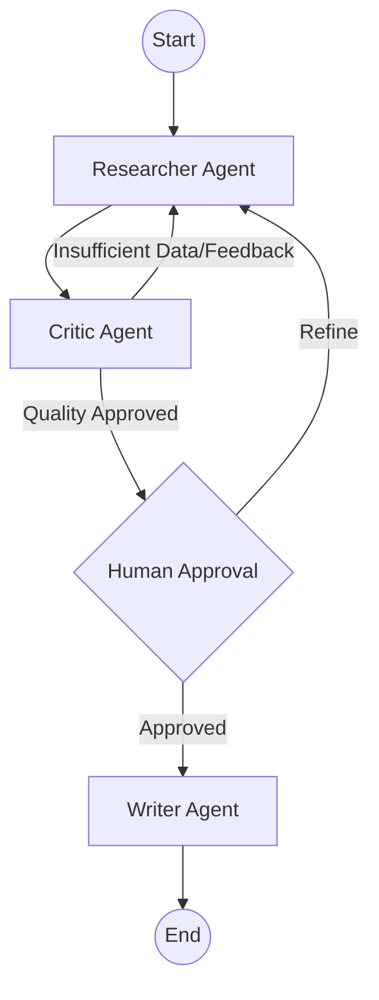

# 🔬 Multi-Agent Research Studio

[](https://www.python.org/downloads/)
[](https://github.com/langchain-ai/langgraph)
[](https://streamlit.io/)
[](https://groq.com/)
[](https://opensource.org/licenses/MIT)

**Multi-Agent Research Studio (MARS)** is a production-grade autonomous research system powered by **LangGraph** and **Groq**. It orchestrates multiple AI agents—Researcher, Critic, and Writer—to conduct deep web research, evaluate information quality, and generate comprehensive reports with human-in-the-loop validation.

---

## 🌟 Key Features

- **🤖 Multi-Agent Orchestration**: Seamless collaboration between Specialized Agents.
- **🔍 Deep Web Research**: Automated, parallelized searches via DuckDuckGo and Wikipedia.
- **🛡️ Quality Assurance**: A Critic agent reflects on research depth and provides refinement feedback.
- **🤝 Human-in-the-Loop**: Pause points for outline approval before final report generation.
- **📊 Real-time Analytics**: Interactive dashboards for quality scores, source distribution, and agent activity.
- **📝 Professional Exports**: Download reports in **Markdown, PDF, HTML, or JSON**.
- **💾 State Persistence**: Session recovery and thread management using LangGraph's checkpointing.

---

## 🏗️ System Architecture

MARS uses a directed cyclic graph (DCG) to manage the research workflow:



### The Agents:
1.  **Researcher**: Generates targeted search queries and synthesizes snippets into factual notes.
2.  **Critic**: Evaluates research notes against the topic requirements. If quality targets aren't met, it loops back with specific logic for refinement.
3.  **Writer**: Transforms approved research notes and outlines into a polished, structured report based on selected templates (Academic, Business, Technical).

---

## 🚀 Getting Started

### 1. Prerequisites
- Python 3.9 or higher
- A **Groq API Key** (Get it at [console.groq.com](https://console.groq.com))

### 2. Set Up Environment
Create a `.env` file in the project root:
```env
GROQ_API_KEY=your_api_key_here
DEFAULT_MODEL=llama-3.3-70b-versatile
```

### 3. Installation
```bash
# Clone the repository
git clone https://github.com/PradhyumnaSharma/Multi-Agent-Research-Studio.git
cd Multi-Agent-Research-Studio

# Create a virtual environment
python -m venv venv
source venv/bin/activate  # Windows: venv\Scripts\activate

# Install dependencies
pip install -r requirements.txt
```

### 4. Run the Studio
```bash
streamlit run app.py
```

---

## ⚙️ Project Structure

- `app.py`: Streamlit dashboard and UI logic.
- `graph/research_graph.py`: LangGraph workflow definition and state management.
- `agents/`: Core logic for Researcher, Critic, and Writer agents.
- `utils/`: Analytics, state helpers, and export utilities.
- `config.py`: Global configuration and template definitions.

---

## 📊 Analytics & Reporting

MARS provides deep insights into the research process:
- **Quality Score Breakdown**: Visualizing different quality dimensions.
- **Agent Activity Log**: Real-time tracking of which agent is doing what.
- **Source Timeline**: Mapping when and where information was retrieved.

---

## 🤝 Acknowledgments

Built with the best-in-class AI infrastructure:
- **[LangGraph](https://github.com/langchain-ai/langgraph)** for stateful agent orchestration.
- **[Groq](https://groq.com/)** for lightning-fast inference.
- **[Streamlit](https://streamlit.io/)** for the interactive research interface.
- **[DuckDuckGo](https://duckduckgo.com/)** & **[Wikipedia](https://wikipedia.org/)** for open-web data.

---
**Built with ❤️ by Pradhyumna Sharma**
