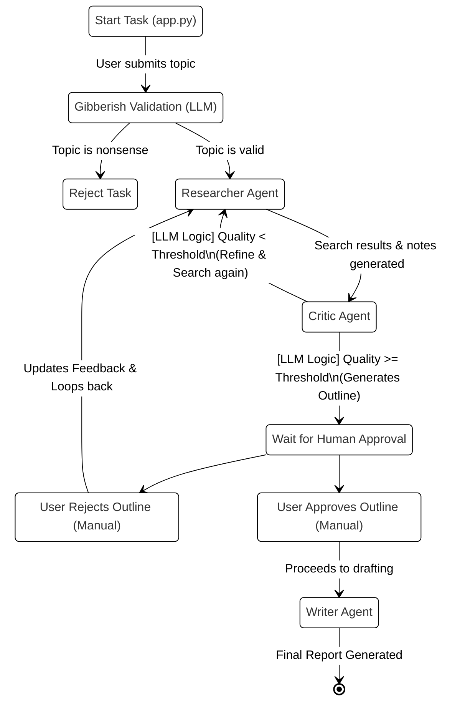

# 🧠 Multi-Agent Research Studio: Architecture & Flow Guide

This document explains the internal mechanics, logic, and mathematics behind the Multi-Agent Research Studio. It is designed to help you understand how the code functions, how the LLM interacts with the code, and what parts require manual human intervention.

---

## 1. System Flow Graph (LangGraph Architecture)

The core workflow is orchestrated by `langgraph`. It directs the state to different agents based on conditions.



---

## 2. Who Does What? (Manual vs. Automated)

### 🧑‍💻 **Manual (Human-Driven)**
1. **Topic Input**: Providing the initial research topic, depth, and template (UI in `app.py`).
2. **Approval phase**: The process physically pauses (`interrupt_before=["human_approval"]`). You must manually read the generated outline.
3. **Decision Making**: You click either **✅ Approve** or **❌ I don't like this outline,Give me a new onw**. 

### 🤖 **Automated (LLM / Code-Driven)**
1. **Gibberish Validation**: The LLM automatically checks if the topic is keyboard smashing before running the heavy graph.
2. **Search Query Generation**: The LLM automatically translates your 1 topic into 3-5 specific search engine queries.
3. **Web Harvesting**: The `Researcher` agent fires concurrent background threads to scrape DuckDuckGo and Wikipedia (`DuckDuckGoSearchAPIWrapper`, `WikipediaAPIWrapper`).
4. **Synthesis**: The LLM compresses raw HTML snippets into readable notes.
5. **Quality Assessment**: The `Critic` agent evaluates the notes and makes a routing decision (Loop back or Proceed).
6. **Outline Creation**: The LLM builds the structure automatically once the Critic is satisfied.
7. **Writing & Formatting**: The `Writer` expands the approved outline into a full report (Markdown).

---

## 3. The Math & Logic Explained

How does the `Critic` agent decide if the research is "good enough"? 

### A. The Quality Score Formula (`utils/state.py`)
Every time the Critic evaluates the data, it calculates a mathematical `quality_score` with a maximum value of `1.0`.

```python
    factors = {
        "source_count": min(len(sources) / 5, 0.4),      # Max 0.4 for finding 2 or more sources
        "note_completeness": min(len(notes) / 5, 0.3),   # Max 0.3 for extracting 1.5+ notes
        "outline_quality": 0.2 if state.get("outline") else 0.0, # 0.2 if an outline exists
        "citation_count": min(len(citations) / 5, 0.1)   # Max 0.1 for citations
    }
    score = sum(factors.values())
    return min(score, 1.0)
```
* **Why this matters**: This score prevents the LLM from entering infinite loops. If the web search fails repeatedly, the score remains low.

### B. The Critic's Routing Decision (`agents/critic.py`)
Once the score is calculated, the `Critic` executes strict logic to decide the next step:

1. **LLM Evaluation**: The LLM reads the notes and is prompted to reply with exactly `STATUS: SUFFICIENT` or `STATUS: INSUFFICIENT`.
2. **Hard Fallback Metrics**: The code does NOT solely trust the LLM. It forces progress if:
   * Total sources >= `MIN_SOURCES_REQUIRED` (3) **AND**
   * Total notes >= 3 **AND**
   * `quality_score` >= `MIN_QUALITY_SCORE` (0.7) **OR** `iteration` >= `MAX_RESEARCH_ITERATIONS` (5)

**Routing Output:**
* If `SUFFICIENT` -> The LLM writes an outline, the graph pauses for the user.
* If `INSUFFICIENT` -> The LLM generates "actionable feedback" detailing what is missing. The graph loops instantly back to the `Researcher`, who uses that exact feedback to generate brand new DuckDuckGo queries.

---

## 4. Detailed Component Walkthrough

### 1. `app.py` (The Director & UI)
- Uses Streamlit to capture user input.
- Initializes the `ResearchGraph` and maintains the **State** (Memory Checkpointer).
- **Graph Streaming**: It loops over `graph.stream(...)`, listening to the agents. When the graph pauses (because of the human approval interruption), it stops the spinner and shows the UI buttons.
- Contains the `reject_and_refine()` function, which forcefully injects rejection feedback into the state and restarts the graph.

### 2. `graph/research_graph.py` (The Map)
- Defines the "Vertices" (Nodes = Agents) and "Edges" (Routes).
- `_should_refine`: Checks if the Critic outputted feedback or an outline. If feedback exists, it points to the Researcher. 
- `_after_human_approval`: The logic that reads the manual UI button click. If `is_approved == False`, it sends the flow backwards to the Researcher.

### 3. `utils/state.py` (The Memory)
- Uses `TypedDict` to define the database schema (State) that is passed between agents.
- Holds critical variables: `topic`, `research_notes` (list of dictionaries), `sources`, `critic_feedback`, and `outline`.
- As agents execute, they modify this central dictionary.

### 4. `agents/researcher.py` (The Gatherer)
- Heavy use of Python `ThreadPoolExecutor`. Instead of searching queries one by one (which is slow), it spins up parallel threads to search DuckDuckGo simultaneously.
- Consumes the `critic_feedback` (if any exists) to figure out better search terms on subsequent loops.

### 5. `agents/writer.py` (The Finisher)
- Only executes if the Human approves the outline.
- Receives the final `outline`, `topic`, and `research_notes`.
- Uses a massive LLM prompt strictly formatted to your chosen `template_type` (Academic, Business, etc.) to stitch the raw notes into a polished Markdown document.
