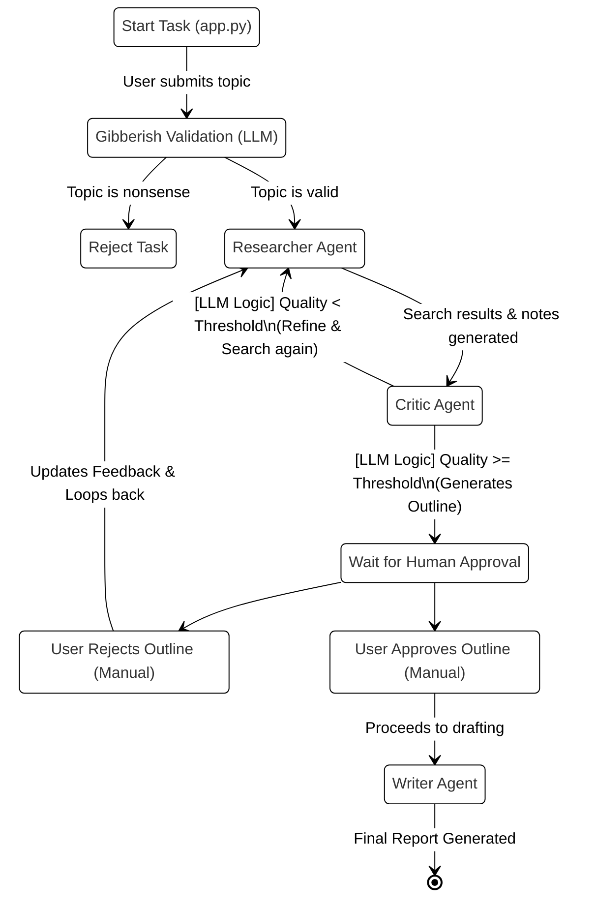

# 🧠 Multi-Agent Research Studio: Architecture & Flow Guide

This document explains the internal mechanics, logic, and mathematics behind the Multi-Agent Research Studio. It is designed to help you understand how the code functions, how the LLM interacts with the code, and what parts require manual human intervention.

---

## 1. System Flow Graph (LangGraph Architecture)

The core workflow is orchestrated by `langgraph`. It directs the state to different agents based on conditions.

---

## 2. Who Does What? (Manual vs. Automated)

### 🧑‍💻 **Manual (Human-Driven)**
1. **Topic Input**: Providing the initial research topic, depth, and template (UI in `app.py`).
2. **Approval phase**: The process physically pauses (`interrupt_before=["human_approval"]`). You must manually read the generated outline.
3. **Decision Making**: You click either **✅ Approve** or **❌ I don't like this outline,Give me a new onw**. 

### 🤖 **Automated (LLM / Code-Driven)**
1. **Gibberish Validation**: The LLM automatically checks if the topic is keyboard smashing before running the heavy graph.
2. **Search Query Generation**: The LLM automatically translates your 1 topic into 3-5 specific search engine queries.
3. **Web Harvesting**: The `Researcher` agent fires concurrent background threads to scrape DuckDuckGo and Wikipedia (`DuckDuckGoSearchAPIWrapper`, `WikipediaAPIWrapper`).
4. **Synthesis**: The LLM compresses raw HTML snippets into readable notes.
5. **Quality Assessment**: The `Critic` agent evaluates the notes and makes a routing decision (Loop back or Proceed).
6. **Outline Creation**: The LLM builds the structure automatically once the Critic is satisfied.
7. **Writing & Formatting**: The `Writer` expands the approved outline into a full report (Markdown).

---

## 3. Intelligence & Logic Explained

How does the system decide if the research is "good enough", and how does it avoid crashing?

### A. Pure LLM-Reasoning & Scoring (`agents/critic.py`)
The system no longer uses hard-coded math or arbitrary source-counting constraints. Instead, the `Critic` agent relies **entirely on the LLM's intrinsic intelligence**.

1. **Evaluation**: The LLM reviews all generated notes, retrieved sources, and previous feedback. It must generate a customized `SCORE` between 0.0 and 1.0 and a `STATUS` of either `SUFFICIENT` or `INSUFFICIENT`.
2. **Parsing**: Code extracts the LLM's textual response using strict regex (`r"SCORE\s*:\s*([0-9]*\.?[0-9]+)"`).
3. **True Agentic Routing**: The workflow does *not* force progress unless the maximum safety iterations (`MAX_RESEARCH_ITERATIONS`) are hit. The flow goes to human approval *only* if the LLM fundamentally agrees the criteria is fulfilled (`SUFFICIENT`).

**Routing Output:**
* If `SUFFICIENT` -> The LLM writes an outline, the graph pauses for the user.
* If `INSUFFICIENT` -> The LLM generates "actionable feedback" detailing what semantic gaps are missing. The graph loops instantly back to the `Researcher`, who uses that exact feedback to generate brand new DuckDuckGo queries.

### B. Clean Data Validation (`agents/researcher.py`)
Search APIs (like Wikipedia/DuckDuckGo) frequently fail quietly due to rate limits or IP bans, returning HTTP connection errors disguised as success objects. 
To ensure the Critic LLM is not "poisoned" by garbage data, the Researcher proactively scans the returned content strings and **destroys** any snippet that contains words like `ConnectError:` or `error sending request`. This prevents the AI from falling into hallucination loops over failed fetch logs.

---

## 4. Detailed Component Walkthrough

### 1. `app.py` (The Director & UI)
- Uses Streamlit to capture user input.
- Initializes the `ResearchGraph` and maintains the **State** (Memory Checkpointer).
- **Graph Streaming**: It loops over `graph.stream(...)`, listening to the agents. When the graph pauses (because of the human approval interruption), it stops the spinner and shows the UI buttons.
- Contains the `reject_and_refine()` function, which forcefully injects rejection feedback into the state and restarts the graph.

### 2. `graph/research_graph.py` (The Map)
- Defines the "Vertices" (Nodes = Agents) and "Edges" (Routes).
- `_should_refine`: Checks if the Critic outputted feedback or an outline. If feedback exists, it points to the Researcher. 
- `_after_human_approval`: The logic that reads the manual UI button click. If `is_approved == False`, it sends the flow backwards to the Researcher.

### 3. `utils/state.py` (The Memory)
- Uses `TypedDict` to define the database schema (State) that is passed between agents.
- Holds critical variables: `topic`, `research_notes` (list of dictionaries), `sources`, `critic_feedback`, and `outline`.
- As agents execute, they modify this central dictionary.

### 4. `agents/researcher.py` (The Gatherer)
- Heavy use of Python `ThreadPoolExecutor`. Instead of searching queries one by one (which is slow), it spins up parallel threads to search DuckDuckGo simultaneously.
- Consumes the `critic_feedback` (if any exists) to figure out better search terms on subsequent loops.

### 5. `agents/writer.py` (The Finisher)
- Only executes if the Human approves the outline.
- Receives the final `outline`, `topic`, and `research_notes`.
- Uses a massive LLM prompt strictly formatted to your chosen `template_type` (Academic, Business, etc.) to stitch the raw notes into a polished Markdown document.
